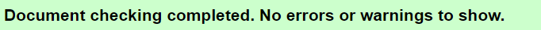

# *Rock, paper, scissors, lizard or spock?*

This is a website containing the well known game of Rock, paper or scissor, but with an interesting twist. This game is for the user who wants to play an easy game with an extra bit of fun. 
 
These extra options were first introduced in an episode of The Big Bang Theory where Sheldon explains the rules: "Scissors decapitate Scissors cuts paper, paper covers rock, rock crushes lizard, lizard poisons Spock, Spock smashes scissors, scissors decapitates lizard, lizard eats paper, paper disproves Spock, Spock vaporizes rock, and as it always has, rock crushes scissors."

Click [*HERE*](https://mollyadamsson.github.io/Rock-Paper-Scissors-Lizard-and-Spock-Game/) to start playing!

# User Experience (UX)

* As a user I want to know the rules
* As a user I want to know the score
* As a user I want to be able to mute the game
* As a user I want to reset the game
* As a user I want to know how much time is left
* As a user I want to know when the game is over

## Wireframes 

This was the first mock up I did for the game, and i was looking for a visual display like this the whole time.

## The structure of the site 

This game is as explained based on the basic game of rock, paper and scissors. It is a game of chance where two, or more, contestants play against each other. This game has some extra features which are the lizard and Spock options.
When entering on to the siteyou are met with a display of blue. This was added with the idea of giving the user a welcoming and warm feeling.

 

There is a header at the top which present the game, underneath you can find three buttons, each with their own ability. If you click "start game" a timer of 30 seconds will start, this was added to make the game a bit more exciting and to "rush" the player to make a decision due to the fact that there is not really any "difficulty levels" of the game. I wanted this feature so that it looks a little more like a game as well. Beside that button there is a "Reset game" optiob, this button resets the game when the player wants to go for another round. On the right on the same row one will find a mute button as well. 

 
Underneath that you can find five more buttons which represents the meaning of the game and they have their of abilitys and functions.
Additionally there are three boxes which contains the player score, round and computer score. This was added to make sure that the player is aware of the status of the game whilst playing.

 
Later underneath that area the player will find the information and result box. The rules of the game and genreal information is provided here. The section in the middle shows what the player and computer chose and who is leading/losing.

## Design Choices

* ### Typography
* The sites main heading is called 'Nabla', This font was chosen considering I wanted the feeling of entering a game. I thought it reminded me of some old school arcade games and I wanted the player to have that feeling as well.

* I later chose 'Bungee shade' for the main buttons, mainly so that they stood out a bit more from the rest, and so that they also had some 'game-feeling'
* To make the rest more readable and coherent I decided to go for the 'Urbanista' font.

* ### Color Scheme
* The color schemes chosen was to yet again, welcome the player with a soft blue background. The focus was to keep it calm and simple for the eye.

* ### Placing
* The placing of buttons and informaton box were positioned to make it easy to navigate between the the sections. The different buttons and boxes are placed in the order of necessity. 

* ### Score and Timer
* The timer is the same as the 'start game' button, mianly so that the player easily can see how they are doing time-wise. The score is placed in the middle of the player and computer score, solely due to the fact that it's in the middle of the entire page and so that that its easy to see it. 

* ### Sound Control

* If the player want they can easily mute the game by using the 'mute game' button on the top right side of the page.

- mute button here - 

* ### The Game
* The game it self is based upon the original game of rock, paper, scissors.
* This particular game has two extra options. Lizard and Spock.
* The player have 5 round to complete the game against the computer, they can choose whichever weapon they want and on random they will see what the computer chose.
* When the game is finished, they can reset the game and try again.

 - provides the content and structure for the website.
* [CSS](https://www.w3.org/Style/CSS/Overview.en.html) - provides the styling.
* [JavaScript](https://developer.mozilla.org/en-US/docs/Web/JavaScript) - provides the interactivity.
* [Balsamiq](https://balsamiq.com/wireframes/) - used to create the wireframes.
* [Gitpod](https://www.gitpod.io/#get-started) - used to deploy the website.
* [Github](https://github.com/) - used to host and edit the website.

# Testing

* ### Lighthouse

* ### Validator HTML

* ### validator CSS

* ### Validator Javascript
[Javascript]
 
# Deployment

### **To deploy the project**
1. When logging into github, navigate to the settings tab,
2. Here you can find pages down on the left side
3. A new page will load which will present the branch to master or main, and then the save option.
4. Once the save button has been clicked and the page is reloaded there will be a link to the deployed site.

# Credits 
* ## Content

* The font came from: 
* The icons came from [Font Awesome]()
* The wireframe was created via [Balsamiq]

* ## Media
* The sound effects was gathered from [Free sound Effects](https://www.freesoundeffects.com)
* The favicon came from [FreeFavIcon]

# Acknowledgements

Molly Adamsson, 2023.

